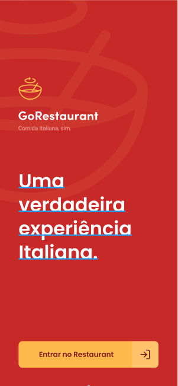
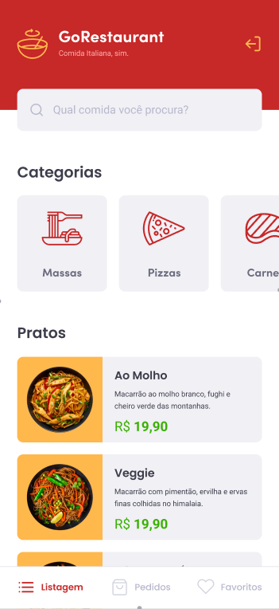
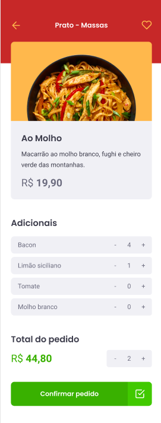

# GoRestaurant - Mobile 🍗
Find the most delicious food around you!

<hr>





## How to run 🚀:
```bash
# Clone this repository
$ git clone https://github.com/EduardoBravoP/react-native-delivery.git

# Go into the repository
$ cd react-native-delivery

# Install dependencies
$ yarn

# Run the JSON Server
$ yarn json-server server.json -p 3333

# Run the app (iOS)
$ yarn ios

# Run the app (Android)
$ yarn android
```
